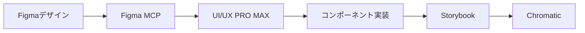
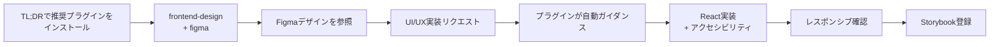

## はじめに

この記事では、フロントエンド開発やUI/UXデザインに携わる方向けに、Claude Codeの実践的な設定を紹介します。

:::message
本記事は [@minorun365](https://qiita.com/minorun365) 氏の「[Claude Codeライトユーザー向け！おすすめ設定まとめ](https://qiita.com/minorun365/items/3711c0de2e2558adb7c8)」を参考に、フロントエンド・UI/UX領域向けにアレンジしたものです。
:::

---

## TL;DR - 今すぐ使いたい人向け

**3ステップの設定で、こんなことが実現できます：**

| 設定 | 実現すること |
|------|-----------|
| **1. frontend-design スキル** | 「ボタン作ってください」と指示するだけで、Claude Code が自動的に**見栄えが良い、プロフェッショナルなUI**を生成。グラスモーフィズム、ニューモーフィズムなど最新デザイントレンドも自動適用 |
| **2. Figma連携** | Figmaで作ったデザインを Claude Code で直接参照 → デザイン完全準拠＆見栄えの良いReactコンポーネント自動生成 |
| **3. CLAUDE.md** | 毎回「React + TypeScript」「このカラーパレットを使って」などの指示の手間をゼロに |

**結果:** 指示するだけで、見栄えが良いプロフェッショナルなUIコンポーネントが自動で完成。デザイナーもエンジニアも「え、これ手動で作ったの？」と言わせるレベルのクオリティが実現できます。

---

### セットアップ手順（5分で完了）

#### 1. frontend-design スキルを高速インストール

このスキルが Claude Code に導入されると、フロントエンド関連のリクエストを検知して、**見栄えの良いプロフェッショナルなUIデザイン**（Glassmorphism、Neumorphism、Bento Grid等の最新トレンド、美しいカラーパレット、洗練されたタイポグラフィなど）を自動的に参照・適用するようになります。

ターミナルで以下を実行：

```bash
mkdir -p ~/.claude/skills/frontend-design
curl -o ~/.claude/skills/frontend-design/SKILL.md https://raw.githubusercontent.com/anthropics/claude-code/main/plugins/frontend-design/skills/frontend-design/SKILL.md
```

→ これ以降、「カードコンポーネントを作ってください」と言うだけで、自動的に**グラフィックデザイン的に美しい、今風のUIが生成**されます。

**または GUI方式（手動が楽な場合）:**
```bash
claude /plugin
# Marketplaces > Browse plugins > frontend-design + figma をインストール
```

#### 2. Figma Access Token を設定

Figma MCP（Model Context Protocol）サーバーをセットアップすることで、Figmaで作ったデザイン（カラー、レイアウト、タイポグラフィなど）を Claude Code が直接読み込み、**それをそのまま見栄え良くReactコンポーネント化**できるようになります。

`~/.claude.json` に追加（なければファイルを新規作成）：

```json
{
  "mcpServers": {
    "figma": {
      "command": "npx",
      "args": ["-y", "@anthropic/mcp-figma"],
      "env": {
        "FIGMA_API_KEY": "figd_xxxxxxxxxxxx"
      }
    }
  }
}
```

**APIキー取得方法:**
- Figma → Settings → Account → Personal access tokens
- 「Generate new token」で新規作成 → `figd_` で始まるトークンをコピー

→ これで「このFigmaのデザインをReactコンポーネントにして」と指示するだけで、Figmaで作ったデザインの見栄えをそのまま実装できるようになります。デザイナーとエンジニアの「見た目のズレ」が完全になくなります。

#### 3. CLAUDE.md にプロジェクトのデザイン・スタイルを記載

プロジェクト共通の「デザインシステム」や「見栄えの方針」を定義することで、毎回「MUIで作ってください」「このカラーパレット使ってください」等を指示する手間が省けます。

```bash
cat > ~/.claude/CLAUDE.md << 'EOF'
## フロントエンド開発ガイド

### 使用技術
- React/Next.js + TypeScript
- Tailwind CSS + MUI
- Storybook 8

### デザイン原則（見た目の統一）
- カラーパレット: [プロジェクトのメインカラー・サブカラー指定]
- タイポグラフィ: [使用フォント]
- スタイル: モダンで洗練された見た目を優先
- レスポンシブ: モバイル・タブレット・デスクトップで美しく表示

### コーディング規約
- コンポーネント: 関数型 + TypeScript
- スタイル: Tailwind CSS 優先、複雑な場合は MUI sx プロップ
EOF
```

→ 以降、単に「ボタンコンポーネント作ってください」とだけ指示すれば、自動的に上記デザイン方針が適用され、見栄えの統一がされます。

---

## 基礎編 - Claude Codeの設定ファイル構造

Claude Codeの設定は以下のディレクトリに集約されます：

```
~/.claude/
├── CLAUDE.md          # グローバルルール（全プロジェクト共通）
├── settings.json      # ユーザー設定
├── agents/            # カスタムサブエージェント
└── skills/            # スキル（UI/UX PRO MAX等）

~/.claude.json         # MCP設定
```

### CLAUDE.md でフロントエンドルールを一元管理

毎回同じ指示を入力する手間を省けます。

```markdown
## 技術スタック
- Next.js 15 (App Router)
- TypeScript 5.x
- MUI 7 + Tailwind CSS 4
- Storybook 8

## コーディング規約
- コンポーネントは関数コンポーネント + TypeScript
- スタイルはTailwind CSSを優先、複雑なものはMUIのsxプロップ
- 命名規則: PascalCase（コンポーネント）、camelCase（変数・関数）

## UI/UX原則
- タッチターゲットは最小44x44px
- コントラスト比 4.5:1 以上（通常テキスト）
- フォーカス状態は必ず視覚的に区別
```

### 音声通知 - 長い処理の完了を見逃さない

Claude Codeが応答したときに音を鳴らす設定です。

`~/.claude/settings.json`:

```json
{
  "hooks": {
    "PostToolUse": [
      {
        "matcher": ".*",
        "hooks": [
          {
            "type": "command",
            "command": "afplay /System/Library/Sounds/Glass.aiff"
          }
        ]
      }
    ]
  }
}
```

### コンテキスト使用率を表示

会話が長くなると自動圧縮され、文脈が失われることがあります。使用率を表示して管理しましょう。

Claude Code起動後に `/config` → Statuslineで設定するか、以下のスクリプトを使用：

`~/.claude/statusline.sh`:

```bash
#!/bin/bash
PERCENT="${CLAUDE_CONTEXT_WINDOW_PERCENT:-0}"
if [ "$PERCENT" -ge 80 ]; then
  echo "CTX:${PERCENT}%"
fi
```

---

## Skills編 - UI/UX PRO MAX

### UI/UX PRO MAX とは

プロフェッショナルなUI/UX構築のためのスキルです。Claude CodeがUIタスクを検知すると自動的に起動し、最適なデザインリソースを参照します。

**主な機能：**
- 57種のUIスタイル（Glassmorphism、Neumorphism、Bento Grid等）
- 95種の業界別カラーパレット
- 56種のフォントペアリング
- 98のUXガイドライン

### インストール

```bash
npm install -g uipro-cli
cd /path/to/your/project
uipro init --ai claude
```

:::message
**個人用 vs チーム共有**

`uipro init` を実行すると `.claude/skills/` 配下に多数のファイルが生成されます。
配置場所によってgit管理の方針が変わります：

| 配置場所 | 用途 | git管理 |
|---------|------|---------|
| `~/.claude/skills/` | 個人用 | しない |
| `プロジェクト/.claude/skills/` | チーム共有 | する |

**推奨**: 汎用スキル（UI/UX PRO MAX等）はホームディレクトリにインストール。
プロジェクト固有のカスタムスキルのみリポジトリで共有。

```bash
# ホームディレクトリにインストール（推奨）
cd ~
uipro init --ai claude
```

プロジェクトに置く場合は `.gitignore` に追加：
```gitignore
.claude/skills/ui-ux-pro-max/
```
:::

### 使い方

UI/UX関連のリクエストをすると自動起動します：

```
SaaS向けのダッシュボードを構築して。
グラスモーフィズムスタイルで、ダークモード対応。
```

スキルが自動的に：
1. 適切なスタイルガイドを検索
2. カラーパレットを提案
3. UXガイドラインに基づいた実装

---

## MCP編 - 外部ツール連携

MCPサーバーを設定することで、Claude Codeの参照精度が向上します。

### Figma MCP

FigmaデザインをClaude Codeから直接参照できます。

**セットアップ手順：**

1. **Figma Access Token を取得**
   - Figma → Settings → Account → Personal access tokens
   - 「Generate new token」でトークンを生成

2. **`~/.claude.json` に設定を追加**

```json
{
  "mcpServers": {
    "figma": {
      "command": "npx",
      "args": ["-y", "figma-developer-mcp", "--stdio"],
      "env": {
        "FIGMA_API_KEY": "figd_xxxxxx..."
      }
    }
  }
}
```

**活用例：**

```bash
# デザインからコンポーネント生成
このFigmaファイルのデザインをReactコンポーネントとして実装して
https://www.figma.com/design/xxxxx/ProjectName?node-id=123-456

# デザイントークンの抽出
このFigmaファイルからカラーパレットとタイポグラフィを抽出して、
Tailwind CSS の設定ファイルを生成して

# デザインレビュー
実装したコンポーネントとFigmaデザインを比較して、差異をレポートして
```

### MUI MCP

MUIコンポーネントのドキュメントを正確に参照できます。

```json
{
  "mcpServers": {
    "mui": {
      "command": "npx",
      "args": ["-y", "@anthropic/mcp-mui"]
    }
  }
}
```

### Playwright MCP

ブラウザ操作やスクリーンショット取得に活用できます。

```json
{
  "mcpServers": {
    "playwright": {
      "command": "npx",
      "args": ["-y", "@anthropic/mcp-playwright"]
    }
  }
}
```

**活用例：**

```bash
# 開発サーバーの画面をキャプチャ
localhost:3000 のトップページをスクリーンショットして

# レスポンシブ確認
localhost:3000 をモバイル（375px）とデスクトップ（1440px）で
スクリーンショットを取って比較して

# インタラクションテスト
ログインフォームに入力してボタンをクリック、
遷移先の画面をキャプチャして
```

### Storybook / Chromatic 連携

Storybookを活用したコンポーネント開発フローを強化できます。

**Storybook MCPの設定：**

```json
{
  "mcpServers": {
    "storybook": {
      "command": "npx",
      "args": ["-y", "storybook-mcp-server", "--port", "6006"]
    }
  }
}
```

**Chromatic（ビジュアルテスト）との連携：**

```bash
# Chromaticのセットアップ
npm install --save-dev chromatic
npx chromatic --project-token=your-token
```

`~/.claude/settings.json` に自動承認を追加：

```json
{
  "permissions": {
    "allow": [
      "Bash(npx chromatic:*)",
      "Bash(npm run storybook:*)"
    ]
  }
}
```

**活用例：**

```bash
# Storybookでコンポーネント確認
Buttonコンポーネントの全バリエーションをStorybookで確認して

# ビジュアルリグレッションテスト
Chromaticでビジュアルテストを実行して、変更点をレポートして

# コンポーネントカタログ生成
src/components配下の全コンポーネントのStorybookストーリーを生成して
```

---

## プラグイン編 - UI/UXデザイン向けプラグイン

Claude Codeのプラグイン・スキル機能を活用することで、フロントエンド・UI/UX開発に特化したツールを統合できます。

### インストール方法（2つの方式）

**方式1: 高速ダウンロード（推奨 - TL;DR）**

```bash
# frontend-design スキルを直接ダウンロード
mkdir -p ~/.claude/skills/frontend-design
curl -o ~/.claude/skills/frontend-design/SKILL.md \
  https://raw.githubusercontent.com/anthropics/claude-code/main/plugins/frontend-design/skills/frontend-design/SKILL.md
```

**方式2: GUI プラグインマーケットプレイス**

```bash
claude /plugin
# Marketplaces > Browse plugins (45) から検索してインストール
```

### TL;DR で推奨する主要プラグイン

#### 1. frontend-design スキル（優先度: 最高）

**機能:**
- UI/UXデザイン仕様の自動参照
- レスポンシブデザイン実装のガイダンス
- WCAG準拠ガイドラインの自動適用
- モダンCSSパターン（Grid、Flexbox等）の参照

**インストール済みの確認:**
```bash
ls ~/.claude/skills/frontend-design/SKILL.md
# ファイルが存在すれば OK
```

#### 2. figma プラグイン / MCP（優先度: 高）

**機能:**
- Figma MCP サーバーを統合（TL;DR Step 2で設定）
- Figmaデザインファイルの直接参照
- デザイン → コンポーネント自動生成
- リアルタイムデザイン更新対応

**設定済みの確認:**
```bash
cat ~/.claude.json | grep -A 5 "figma"
# mcpServers.figma が設定されていれば OK
```

### プラグイン有効化確認

インストール後、Claude Code を再起動してプラグインを認識させます：

```bash
claude /plugin
# Installed タブで以下が表示されることを確認
#   - frontend-design
#   - figma
```

### 実装例

プラグイン導入後のリクエスト例：

```
プロダクト用のカードコンポーネントを実装して。

要件：
- React + TypeScript
- Tailwind CSS + MUI
- アクセシビリティ対応（WCAG 2.1 AA）
- レスポンシブデザイン（モバイル/タブレット/デスクトップ）
- ダークモード対応
```

**結果:**
- `frontend-design` プラグインが UI/UXガイドラインを自動参照
- `figma` MCPが Figmaデザイン仕様を適用
- アクセシビリティ対応のプロダクション品質コンポーネント生成

### Installed プラグイン管理

インストール済みプラグインの確認・管理：

```
/plugin > Installed

表示される情報：
- プラグイン名と説明
- インストール数（人気度）
- 更新日時
- 無効化 / 削除オプション
```

:::message
**推奨プラグイン構成（優先度順）**

フロントエンド・UI/UXデザイナー向け：

| プラグイン | 用途 | 優先度 |
|-----------|------|--------|
| **frontend-design** | UI/UX実装ガイダンス | ⭐ 最優先 |
| **figma** | Figmaデザイン連携（MCP + Skills） | ⭐ 最優先 |
| pr-review-toolkit | コードレビュー・品質確認 | 推奨 |
| accessibility-checker | WCAG準拠確認 | 推奨 |

**インストール手順：**
```bash
claude /plugin
# Marketplaces > Browse plugins (45) を開く
# 上記の「⭐ 最優先」の2つを検索してインストール
```
:::

### プラグインの自動更新設定

Marketplaces から自動更新を有効化：

```
/plugin > Marketplaces > claude-plugins-official
  ✓ Auto-update enabled
    (Claude Codeが定期的にプラグインを更新)
```

**最終更新確認例：**
```
Updated 2026/1/14
```

---

## 自動承認設定

参照系の操作を自動承認することで、ワークフローがスムーズになります。

`~/.claude/settings.json`:

```json
{
  "permissions": {
    "allow": [
      "WebFetch(domain:figma.com)",
      "WebFetch(domain:storybook.js.org)",
      "WebFetch(domain:mui.com)",
      "Bash(npm run storybook:*)",
      "Bash(npx playwright:*)"
    ]
  }
}
```

---

## 実践ワークフロー例

### ワークフロー1: Figma → React コンポーネント



**プロンプト例：**

```
このFigmaデザインを参考に、MUI + Tailwindでカードコンポーネントを実装して。
https://www.figma.com/design/xxxxx?node-id=123-456

要件：
- レスポンシブ対応（モバイル/タブレット/デスクトップ）
- ダークモード対応
- アクセシビリティ（WCAG 2.1 AA）
- Storybookストーリーも作成
```

### ワークフロー2: デザインシステム構築

**プロンプト例：**

```
プロジェクトのデザインシステムを構築して。

1. Figmaからデザイントークン（カラー、タイポグラフィ、スペーシング）を抽出
2. Tailwind CSS設定ファイルを生成
3. MUIテーマファイルを生成
4. 基本コンポーネント（Button、Input、Card）を実装
5. Storybookでドキュメント化
```

### ワークフロー3: 既存UIのリファクタリング

**プロンプト例：**

```
src/components/配下のコンポーネントをレビューして。

確認観点：
- UXガイドライン準拠（タッチターゲット、コントラスト比）
- アクセシビリティ（aria属性、キーボード操作）
- レスポンシブ対応
- パフォーマンス（不要な再レンダリング）

問題があれば修正して、改善レポートを作成して。
```

### ワークフロー4: ビジュアルリグレッションテスト

**プロンプト例：**

```
以下の手順でビジュアルテストを実施して：

1. Storybookを起動
2. 全コンポーネントのスクリーンショットを取得
3. Chromaticにアップロード
4. 前回からの変更点をレポート
```

### ワークフロー5: プラグイン + Figma連携でUI/UXを高速実装



**推奨セットアップ順序：**

1. **プラグイン一括インストール（TL;DR参照）**
```bash
claude /plugin
# Marketplaces > Browse plugins から以下をインストール：
# - frontend-design
# - figma
```

2. **Figma APIキーを設定（TL;DR参照）**
```bash
# ~/.claude.json に Figma APIキーを追加
# これで Figma ファイルを直接 Claude Code から参照可能に
```

3. **デザイン実装リクエスト例**

Figmaファイルを参照しながら実装：
```
このFigmaデザインをもとに、カードコンポーネントを実装して。
https://www.figma.com/design/xxxxx/ProjectName?node-id=123-456

要件：
- React + TypeScript
- Tailwind CSS + MUI
- レスポンシブ対応（モバイル/タブレット/デスクトップ）
- ダークモード対応
- WCAG 2.1 AA準拠
```

**プラグインの自動ガイダンス**：
- `frontend-design`: UI/UXガイドライン、ベストプラクティスを自動参照
- `figma`: Figmaデザイン仕様を直接参照 → コンポーネント実装へ
- 結果：デザイン完全準拠 + アクセシビリティ対応のコンポーネントが生成

---

## まとめ

### 各設定の効果

| 設定 | 効果 | セクション |
|------|------|-----------|
| **プラグイン（frontend-design + figma）** | UI/UX実装の自動ガイダンス | TL;DR |
| **Figma APIキー設定** | Figmaデザイン直接参照 | TL;DR |
| **CLAUDE.md** | 毎回の指示入力を削減 | TL;DR |
| UI/UX PRO MAX | デザインリソース・ガイドライン | Skills編 |
| Storybook/Playwright | 品質担保・テスト自動化 | MCP編 |
| 自動承認設定 | 参照系操作の効率化 | その他 |

### 実装ワークフロー

```
TL;DR3ステップ
  ↓
基本設定完了
  ↓
プラグイン自動ガイダンス + Figma連携
  ↓
デザイン完全準拠の高品質UI実装
  ↓
Storybook/Chromaticで品質確認
```

### 推奨セットアップ（優先度順）

**必須（TL;DR）:**
1. `claude /plugin` でfrontend-design + figmaプラグインをインストール
2. Figma APIキーを `~/.claude.json` に設定
3. `~/.claude/CLAUDE.md` でフロントエンド開発ルール定義

**推奨（基礎固めの後）:**
4. UI/UX PRO MAX をホームディレクトリにインストール
5. Storybook/Playwright MCP設定
6. 自動承認設定で ワークフロー効率化

フロントエンド・UI/UX開発において、**TL;DRの3ステップだけで効果を実感**でき、その後段階的に高度な設定を追加できます。

## 参考リンク

- [Claude Code 公式ドキュメント](https://docs.anthropic.com/claude-code)
- [UI/UX PRO MAX GitHub](https://github.com/nextlevelbuilder/ui-ux-pro-max-skill)
- [MCP 公式ドキュメント](https://modelcontextprotocol.io/)
