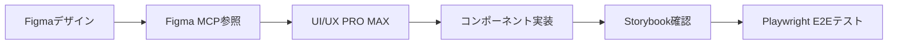

## はじめに

この記事では、フロントエンド開発やUI/UXデザインに携わる方向けに、Claude Codeの実践的な設定を紹介します。

:::message
本記事は [@minorun365](https://qiita.com/minorun365) 氏の「[Claude Codeライトユーザー向け！おすすめ設定まとめ](https://qiita.com/minorun365/items/3711c0de2e2558adb7c8)」を参考に、フロントエンド・UI/UX領域向けにアレンジしたものです。
:::

---

## TL;DR - 今すぐ使いたい人向け

**最低限これだけやれば効果を実感できる設定**を厳選しました。

### 1. UI/UX PRO MAX スキルを導入

```bash
npm install -g uipro-cli
cd /path/to/your/project
uipro init --ai claude
```

→ 57種のUIスタイル、95種のカラーパレット、UXガイドラインが即座に使えるようになります。

### 2. Figma MCP を設定

`~/.claude.json` に追加：

```json
{
  "mcpServers": {
    "figma": {
      "command": "npx",
      "args": ["-y", "@anthropic/mcp-figma"]
    }
  }
}
```

→ FigmaデザインをClaude Codeから直接参照・コード化できます。

### 3. CLAUDE.md にフロントエンド向けルールを記載

`~/.claude/CLAUDE.md` を作成：

```markdown
## フロントエンド開発ルール
- UIコンポーネントはアクセシビリティ（WCAG 2.1 AA）を考慮する
- レスポンシブデザインはモバイルファーストで実装
- 使用スタック: React/Next.js + Tailwind CSS + MUI
```

---

## 基礎編 - Claude Codeの設定ファイル構造

Claude Codeの設定は以下のディレクトリに集約されます：

```
~/.claude/
├── CLAUDE.md          # グローバルルール（全プロジェクト共通）
├── settings.json      # ユーザー設定
├── agents/            # カスタムサブエージェント
└── skills/            # スキル（UI/UX PRO MAX等）

~/.claude.json         # MCP設定
```

### CLAUDE.md でフロントエンドルールを一元管理

毎回同じ指示を入力する手間を省けます。

```markdown
## 技術スタック
- Next.js 15 (App Router)
- TypeScript 5.x
- MUI 7 + Tailwind CSS 4
- Storybook 8

## コーディング規約
- コンポーネントは関数コンポーネント + TypeScript
- スタイルはTailwind CSSを優先、複雑なものはMUIのsxプロップ
- 命名規則: PascalCase（コンポーネント）、camelCase（変数・関数）

## UI/UX原則
- タッチターゲットは最小44x44px
- コントラスト比 4.5:1 以上（通常テキスト）
- フォーカス状態は必ず視覚的に区別
```

### 音声通知 - 長い処理の完了を見逃さない

Claude Codeが応答したときに音を鳴らす設定です。

`~/.claude/settings.json`:

```json
{
  "hooks": {
    "PostToolUse": [
      {
        "matcher": ".*",
        "hooks": [
          {
            "type": "command",
            "command": "afplay /System/Library/Sounds/Glass.aiff"
          }
        ]
      }
    ]
  }
}
```

### コンテキスト使用率を表示

会話が長くなると自動圧縮され、文脈が失われることがあります。使用率を表示して管理しましょう。

Claude Code起動後に `/config` → Statuslineで設定するか、以下のスクリプトを使用：

`~/.claude/statusline.sh`:

```bash
#!/bin/bash
PERCENT="${CLAUDE_CONTEXT_WINDOW_PERCENT:-0}"
if [ "$PERCENT" -ge 80 ]; then
  echo "CTX:${PERCENT}%"
fi
```

---

## Skills編 - UI/UX PRO MAX

### UI/UX PRO MAX とは

プロフェッショナルなUI/UX構築のためのスキルです。Claude CodeがUIタスクを検知すると自動的に起動し、最適なデザインリソースを参照します。

**主な機能：**
- 57種のUIスタイル（Glassmorphism、Neumorphism、Bento Grid等）
- 95種の業界別カラーパレット
- 56種のフォントペアリング
- 98のUXガイドライン

### インストール

```bash
npm install -g uipro-cli
cd /path/to/your/project
uipro init --ai claude
```

### 使い方

UI/UX関連のリクエストをすると自動起動します：

```
SaaS向けのダッシュボードを構築して。
グラスモーフィズムスタイルで、ダークモード対応。
```

スキルが自動的に：
1. 適切なスタイルガイドを検索
2. カラーパレットを提案
3. UXガイドラインに基づいた実装

---

## MCP編 - 外部ツール連携

MCPサーバーを設定することで、Claude Codeの参照精度が向上します。

### Figma MCP

FigmaデザインをClaude Codeから直接参照できます。

```json
{
  "mcpServers": {
    "figma": {
      "command": "npx",
      "args": ["-y", "@anthropic/mcp-figma"],
      "env": {
        "FIGMA_ACCESS_TOKEN": "your-token-here"
      }
    }
  }
}
```

**活用例：**
```
このFigmaファイルのデザインをReactコンポーネントとして実装して
https://www.figma.com/file/xxxxx
```

### MUI MCP

MUIコンポーネントのドキュメントを正確に参照できます。

```json
{
  "mcpServers": {
    "mui": {
      "command": "npx",
      "args": ["-y", "@anthropic/mcp-mui"]
    }
  }
}
```

### Playwright MCP

E2Eテストやビジュアルリグレッションテストに活用できます。

```json
{
  "mcpServers": {
    "playwright": {
      "command": "npx",
      "args": ["-y", "@anthropic/mcp-playwright"]
    }
  }
}
```

**活用例：**
- コンポーネントのスクリーンショット取得
- インタラクションテストの自動生成
- レスポンシブ表示の確認

### Storybook / Chromatic 連携

Storybookを活用したコンポーネント開発フローを強化できます。

```json
{
  "mcpServers": {
    "storybook": {
      "command": "npx",
      "args": ["-y", "@anthropic/mcp-storybook"]
    }
  }
}
```

**活用例：**
```
Buttonコンポーネントの全バリエーションをStorybookで確認して、
デザインと実装の差異をレポートして
```

---

## 自動承認設定

参照系の操作を自動承認することで、ワークフローがスムーズになります。

`~/.claude/settings.json`:

```json
{
  "permissions": {
    "allow": [
      "WebFetch(domain:figma.com)",
      "WebFetch(domain:storybook.js.org)",
      "WebFetch(domain:mui.com)",
      "Bash(npm run storybook:*)",
      "Bash(npx playwright:*)"
    ]
  }
}
```

---

## 実践ワークフロー例

### デザイン → 実装フロー



1. **Figma参照**: デザインファイルのURLを渡す
2. **スキル活用**: UI/UX PRO MAXが適切なスタイル・ガイドラインを適用
3. **実装**: コンポーネントを生成
4. **確認**: Storybookで各状態を確認
5. **テスト**: Playwrightでビジュアルテスト

### プロンプト例

```
# 新規コンポーネント作成
このFigmaデザインを参考に、MUI + Tailwindでカードコンポーネントを実装して。
レスポンシブ対応、ダークモード対応、アクセシビリティも考慮して。
Storybookのストーリーも作成して。

# 既存コンポーネントのレビュー
src/components/Button.tsxをUXガイドラインに基づいてレビューして。
改善点があれば修正して。
```

---

## まとめ

| 設定 | 効果 |
|------|------|
| CLAUDE.md | 毎回の指示入力を削減 |
| UI/UX PRO MAX | デザインリソース・ガイドラインを自動参照 |
| Figma MCP | デザイン→実装の橋渡し |
| Storybook/Playwright | 品質担保・テスト自動化 |

フロントエンド・UI/UX開発において、これらの設定を組み合わせることで、デザインから実装、テストまでのワークフローを大幅に効率化できます。

## 参考リンク

- [Claude Code 公式ドキュメント](https://docs.anthropic.com/claude-code)
- [UI/UX PRO MAX GitHub](https://github.com/nextlevelbuilder/ui-ux-pro-max-skill)
- [MCP 公式ドキュメント](https://modelcontextprotocol.io/)
